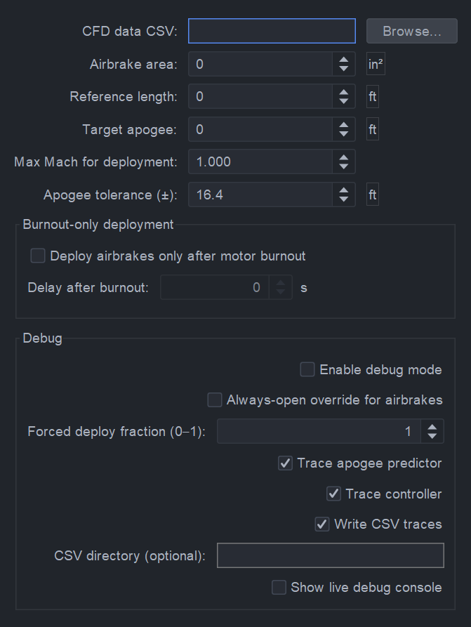

# AirBrakes System Plugin for OpenRocket

A plugin for NCSU HPRC's Air Brakes system to interface with OpenRocket to determine apogee with simulated Air Brakes deployment. Utlizes CFD data to interpolate a drag-extension-mach contour for any given mach number based on a .csv file. This feeds an RK4 based apogee predication to determine apogee every simulation timestep. The overall logic is a bang-bang control scheme to extend or retract Air Brakes. 

# Usage

Simply download the latest .jar file from the releases tab and insert into the directory 'C:\Users\[user]\AppData\Roaming\OpenRocket\Plugins'

Then the following option pane opens when the extension is added

The user will supply the area of the Air Brakes fins, the CFD derived data, and the Target Apogee. Other options include, specifc time to deploy after motor burnout and apogee tolerance for tighter conversions. 

Lastly the .csv file must contain these headers in this order:
Col 1: Mach
Col 2: DeploymentPercentage (as a decimal)
Col 3: Drag (in Newtons)

